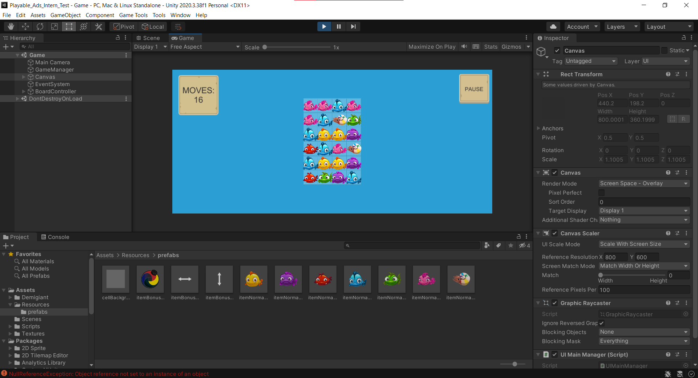
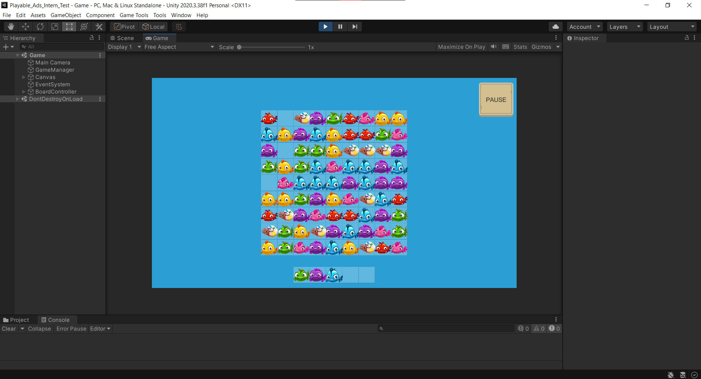
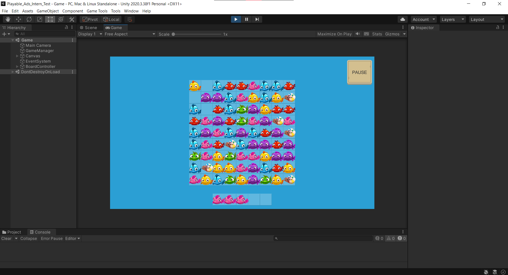
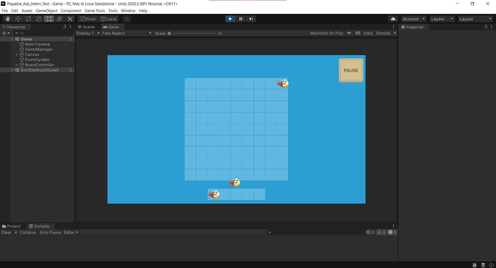
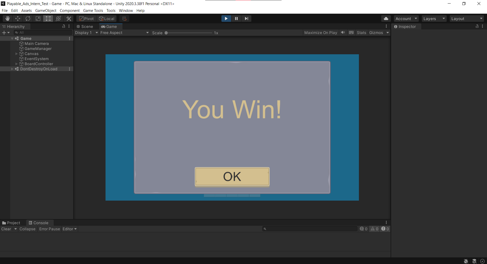
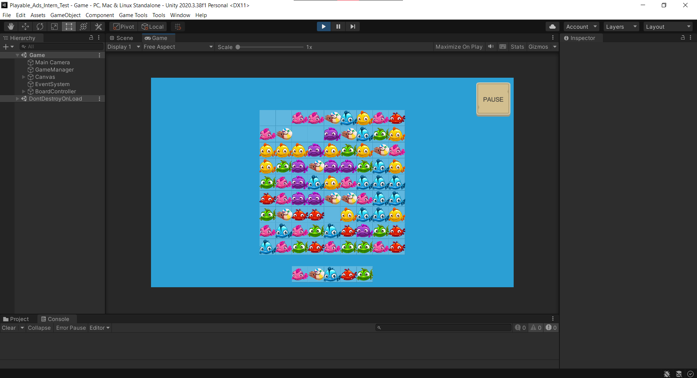
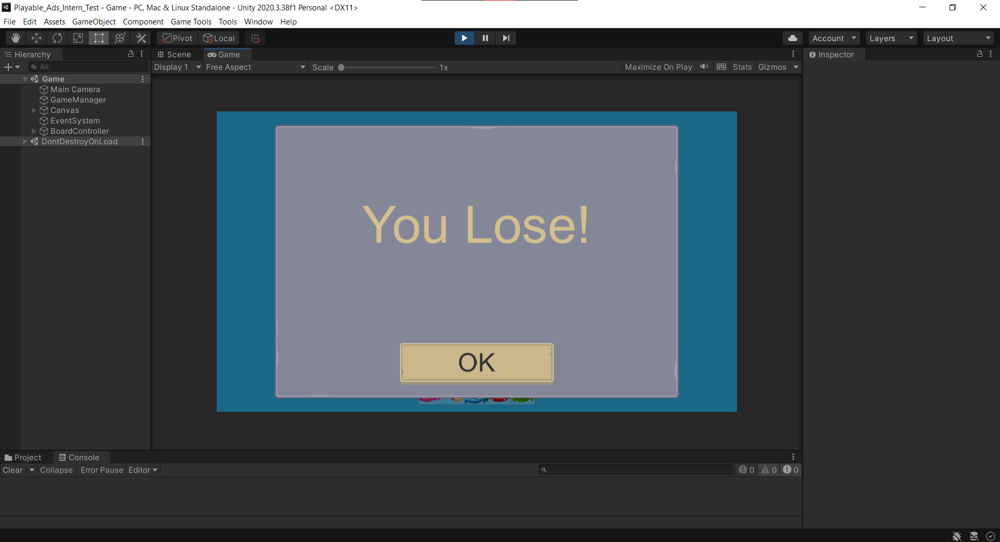
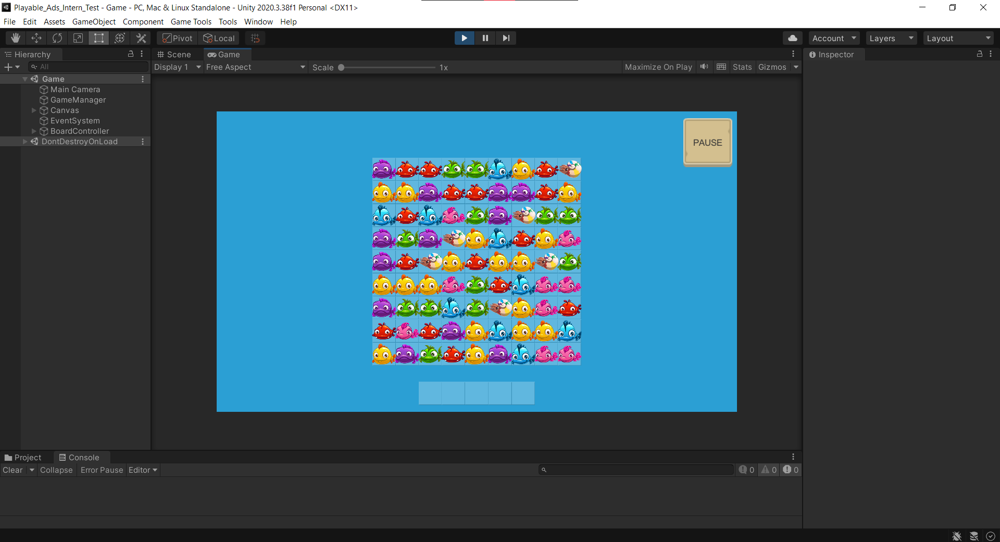

# Plâyble Ads - Unity Developer Intern Test
## Nuyễn Thái Sơn

### Các task
### Task 1: Reskin

- Đối với task này, em giữ nguyên cấu trúc prefab và logic xử lý item hiện có, chỉ thay đổi sprite của từng loại item sang fish tương ứng:
* character_0001 -> fish_1
* character_0002 -> fish_2
* character_0003 -> fish_3
* character_0004 -> fish_4
* character_0005 -> fish_5
* character_0006 -> fish_6
* character_0007 -> rainbow_fish
- Giao diện sau khi thay đổi:

### Task 2: Change the Gameplay
- Di chuyển vật thể từ trên bảng xuống khay đựng bên dưới khi được nhấn vào

- Item sau khi được đưa xuống Bottom Cells sẽ không thể được di chuyển ngược trở lại board
- Nếu có chính xác 3 item giống nhau thì 3 item sẽ được xóa khỏi Bottom Cells

- Nếu bảng không còn item nào thì chiến thắng:
* Còn 3 cuối cùng:

* Chiến thắng:

* Nếu khay dưới đầy mà chưa ăn hết thì thua:

- Auto Play:
* 1. Tìm item phú hợp trên board
* 2. Di chuyển item xuống Bottom Cells.
* 3. Ưu tiên hoàn thành các nhóm item đang có sẵn ở Bottom Cells.
* 4. Khi có đủ 3 item giống nhau, hệ thống tự động clear nhóm đó.
* 5. Tiếp tục thực hiện các nước đi tiếp theo.
* 6. Kết thúc bằng trạng thái Win khi board không còn item.
- Auto Lose:
* 1. Kiểm tra Bottom Cells.
* 2. Tìm item chưa tạo Match 3.
* 3. Di chuyển item đó xuống Bottom Cells.
* 4. Tiếp tục kiểm tra Bottom Cells và lặp lại các bước 2,3.
* 5. Kết thúc bằng trạng thái Lose khi Bottom Cells đầy.

### Task 3: Improve the gameplay
- Đảm bảo có tất cả các loại cá:

* Tăng size của board lên thành 9x9
* Tạo 1 danh sách chứa tất cả các loại cá
* Mỗi loại cá sẽ cho tạo ngẫu nhiên 6 con cá ở các vị trí khác nhau (đảm bảo mỗi loại cá luôn có ít nhất là 2 match-3)
* Các vị trí còn trống sẽ được tạo match-3 ngẫu nhiên
- Animation cho item từ board xuống bottom cells và animation biến mất match 3.
- Time Attack Mode.